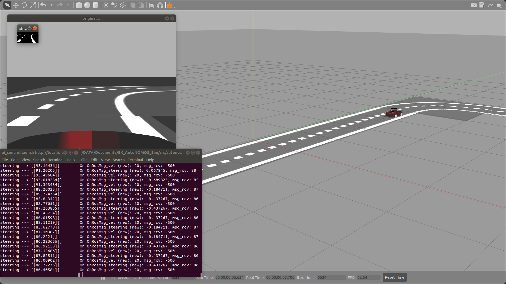

# ai_controlled_car
This repository is meant to control a [car model](https://github.com/AutoModelCar), using neural networks in order to follow a trajectory within his lane and avoid moving obstacles.

Watch it in action in the following [video](https://www.youtube.com/watch?v=G2VfvcxQOz4)




### Tested with the following settings
- **ROS** (melodic, 1.14.3)
- **Ubuntu** (16.04.5 LTS)
- **python-catkin-tools**

## How to build
On the root directory (where this `README.md` file can be found) execute the following commands:

```bash
catkin build
source devel/setup.bash
```
## How to use
Currently the simulation comes from another project, so please follow the instructions on the the next [repository](https://github.com/EagleKnights/EK_AutoNOMOS_Sim)'s [wiki](https://github.com/EagleKnights/Eagle_Knights-Wiki/wiki) in order to set the car model simulator.

Then open a terminal on the root directory and execute the following commands:

```bash
roslaunch ai_control.launch
```
